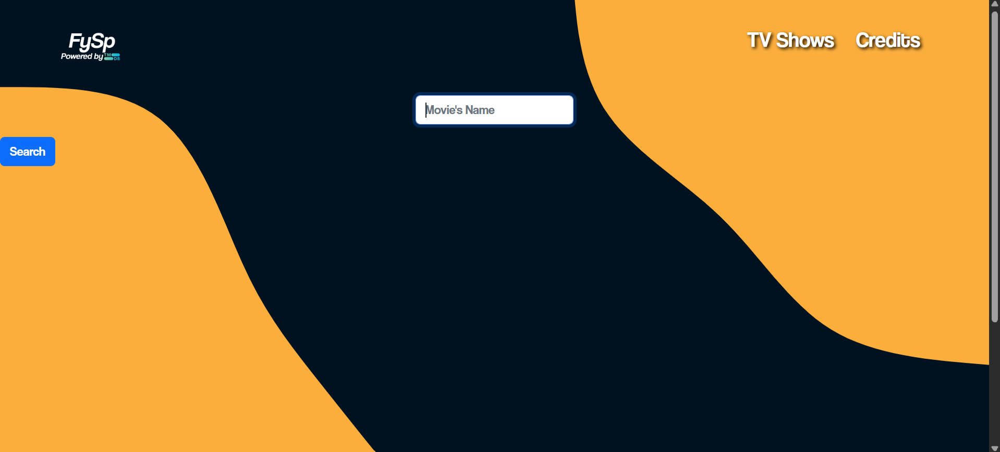
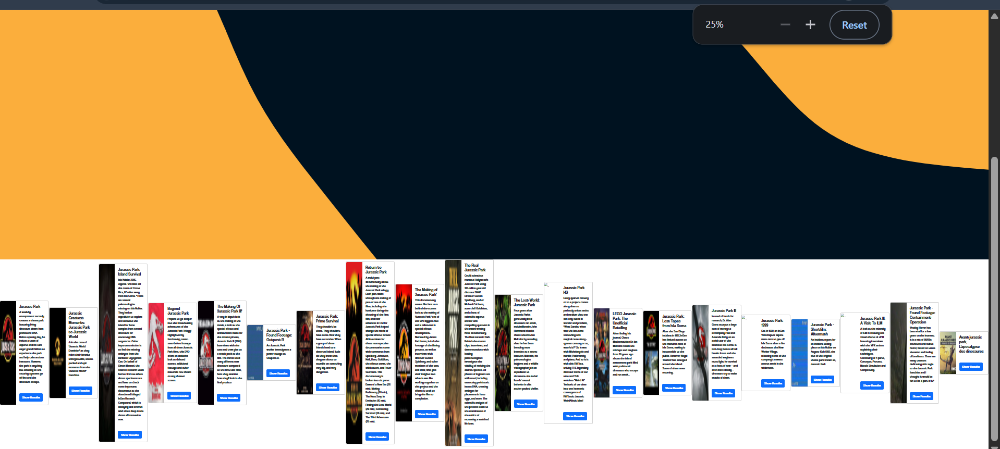
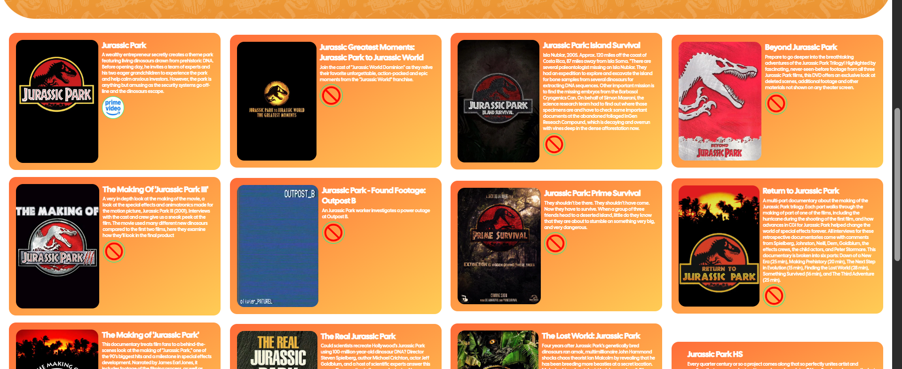
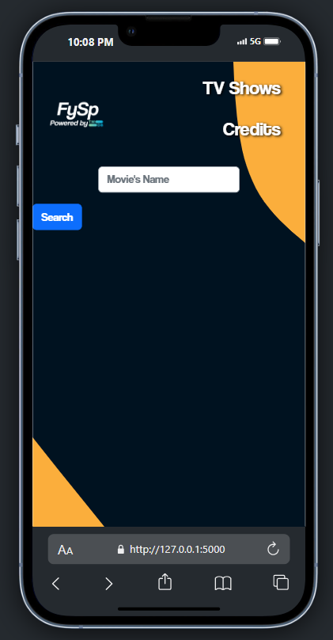
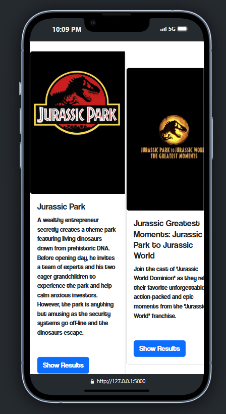
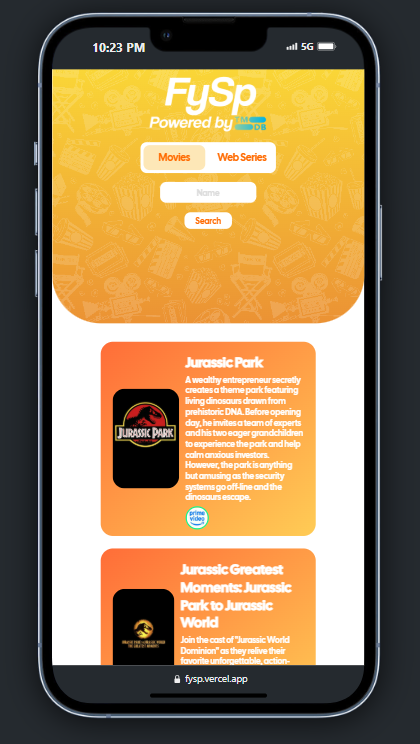

# The __new_main__ branch 

It's been 3 years since I did that project. Since then I have tried to improve myself. Obviously, not all the way there yet, but still I took a dig at trying to **overhaul** the broken UI that I, an amateur, had made 3-4 years ago.

## The Ugly Parts of the old UI vs the changes I made

- Was using Bootstrap, which gives the UI a very *generic* corporate look that I now detest
    - So as I learnt more about HTML and CSS, certain methods, etc, I applied in this new UI
    - Thereby, the new version uses fully raw HTML and CSS, no third party involved

### 1. Poor alignments, lack of flair, consistency, unnecessary navigation links (changed to two radio buttons)

<table>
  <tr>
    <td width="33%">
      
    </td>
    <td width="33%">
      
    </td>
    <td width="33%">
      
    </td>
  </tr>
  <tr>
    <td colspan="3" align="center">
      
    </td>
  </tr>
</table>

### 2. Disgusting Display of Results

<table>
  <tr>
    <td width="50%">
      
      
<em>Before: Cluttered and unprofessional</em>

    </td>
    <td width="50%">
      
      
<em>After: Clean and organized</em>

    </td>
  </tr>
</table>

### 3. Not considering Mobile's constraints

<table>
  <tr>
    <td width="33%">
      
    </td>
    <td width="33%">
      
    </td>
    <td width="33%">
      
    </td>
  </tr>
  <tr>
    <td colspan="2" align="center">
      <em>Before: Poor mobile responsiveness</em>
    </td>
    <td align="center">
      <em>After: Mobile-optimized design</em>
    </td>
  </tr>
</table>
